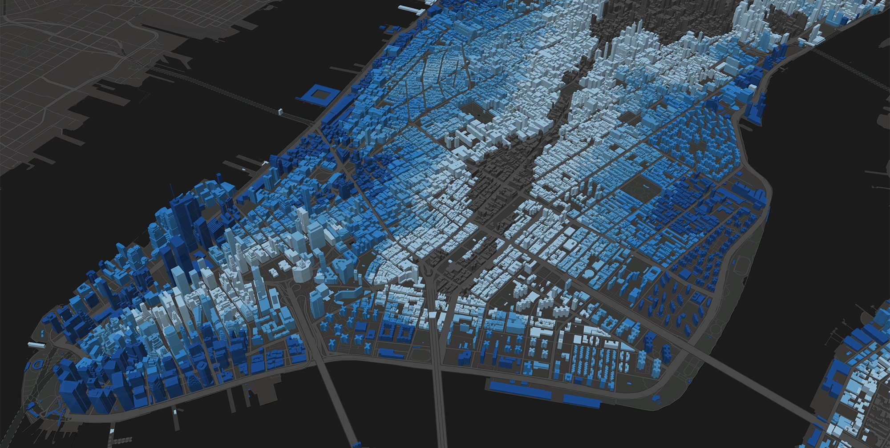
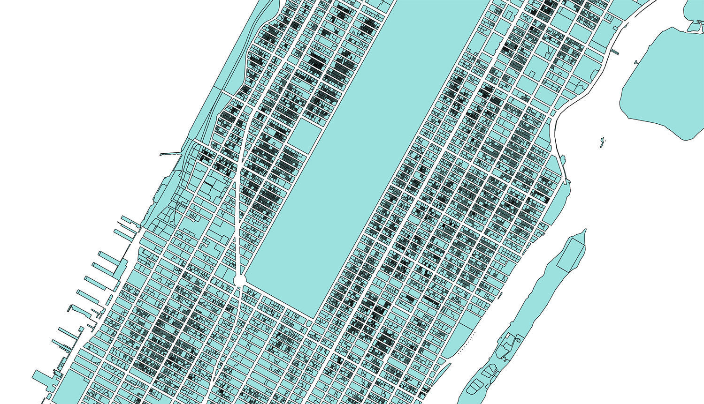

# Data Pipeline for New York Visualization
Documentation for visualizing environmental risks in New York City. The visualization is presented using Mapbox-Gl through Node.Js framework.

## [Wiki](https://github.com/UrbanEcologyLab/data-pipeline-newYork/wiki)
Read [here](https://github.com/UrbanEcologyLab/data-pipeline-newYork/wiki) for more details

#### City Infrastructure Datasets
- Open Map Tiles: 3D buildings
- MapPluto Dataset : City Lots

#### City Risk Datasets
- Surface Temperature: LandSat Thermal Bands
- Coast Flood Zone: FEMA NYC Flood Inundation Zones
-	Elderly Population Density
- Ethnic Group Distrubution

#### Process
The risk modelling was carried out on lot level. The attributes of lots were then spatially merged with building features within respective lot. The buildings were used as a canvas to visualize the data.

## Open Map Tiles: 3D buildings

#### *Dataset* :
You can find the Open Map Tiles data [here](https://openmaptiles.org/downloads/#city). Search for New York or use this direct link: [OpenMapTiles.org](https://openmaptiles.os.zhdk.cloud.switch.ch/v3.3/extracts/new-york_new-york.mbtiles).
To convert .mbtiles to .geojson, use [Tippecanoe-decode](https://github.com/mapbox/tippecanoe#tippecanoe-decode). Geojson can then further be converted to .shp files using [ogr2ogr](http://gis.stackexchange.com/questions/68175/geojson-to-esri-shapefile-using-ogr2ogr)

#### *Description* :
The Open Map Tiles dataset essentially contains building and building part heights, along with common city infrastructure features. Height attributes are useful to reconstruct extruded geometries of the buildings.
The dataset is also made available by [Overpass API](overpass-api.de)

**To use Overpass API instead of Open Map Tiles, follow the steps below:**
- Follow the steps here [UrbanEcologyLab/overpass-api-tiles](https://github.com/UrbanEcologyLab/overpass-api-tiles) to download a OSM tiles and create a geoJSON from them, for a specified bounding box
- To convert the .geoJSON to .mbtiles, use [tippecanoe](https://github.com/mapbox/tippecanoe)

#### *Repository* :
To visualize the dataset in Mapbox-Gl refer to [3D-city-buildings-newYork](https://github.com/UrbanEcologyLab/3d-city-buildings-newYork/tree/master/Mapbox)

## MapPluto Dataset : 2D City Lots

#### *Dataset* :
The open dataset is provided by [NYC Department of City Planning](https://www1.nyc.gov/site/planning/data-maps/open-data/dwn-pluto-mappluto.page).

#### *Description* :
It contains building lots and the risk assessment modelling was performed at lot level. The attributes to be visualized were added to MapPluto Dataset as additional columns. The final lots data served as a base layer from which the properties were ported building features inside each respective lot. This was done through [spatial-merge](https://github.com/UrbanEcologyLab/turf-spatial-merge)
